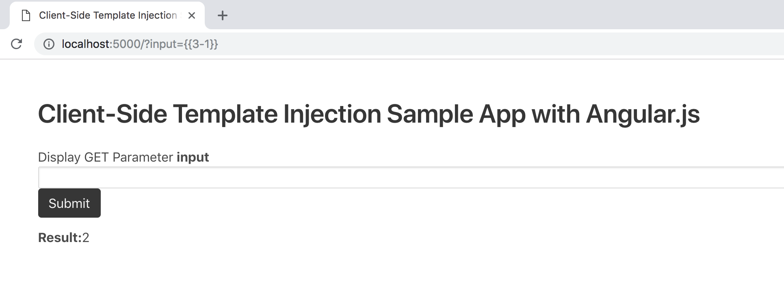
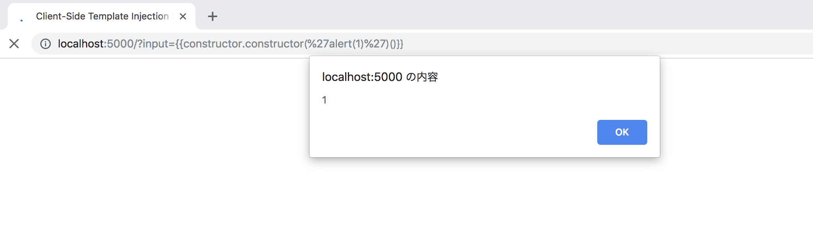

# Client-Side Template Injection Sample App with AngularJS
Client-side template injection vulnerabilities occur when web application using a client-side template framework dynamically embed user input. 
This Sinatra app has a client-side template injection vulnerability with AngularJS. Let's attack it!



`{{constructor.constructor('alert(1)')()}}` fire `alert()`.



# How to use
Run `startup.sh`, sintra app work on 5000 port.

```
$ ./startup.sh
```

## Docker
Also DockerFile exists.

```
$ docker build . 
$ docker run -p 5000:5000 -d <IMAGE ID>
```

# Case study
- [#230234 [mercantile.wordpress.org] Reflected XSS via AngularJS Template Injection](https://hackerone.com/reports/230234)
- [#250837 Stored xss via template injection](https://hackerone.com/reports/250837)
- [Reflective XSS via angularJS template injection - Hostinger – Taha Ibrahim DRAIDIA – Random Thoughts Mostly About Ethical Hacking](https://blog.ibrahimdraidia.com/xss-via-angularjs-template-injection_hostinger/)


# Licence
The MIT License
